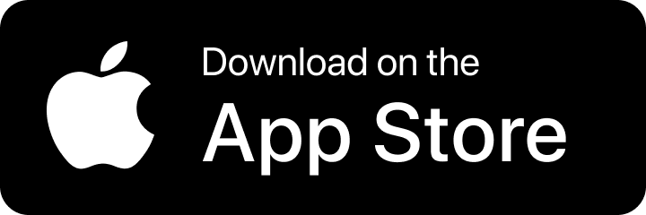
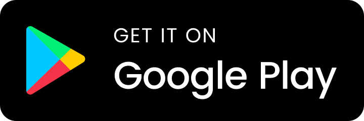

<h1>
  
  Life Battery
</h1>

 

Life Battery tells you what percentage of your life remains⚡️  

Future features:  
- A widget to check battery life without opening the app📲
- Push notifications when battery life decreases🪫
- Customizable battery UI design🎨
- Night sky starry feature⭐️
- And more...
