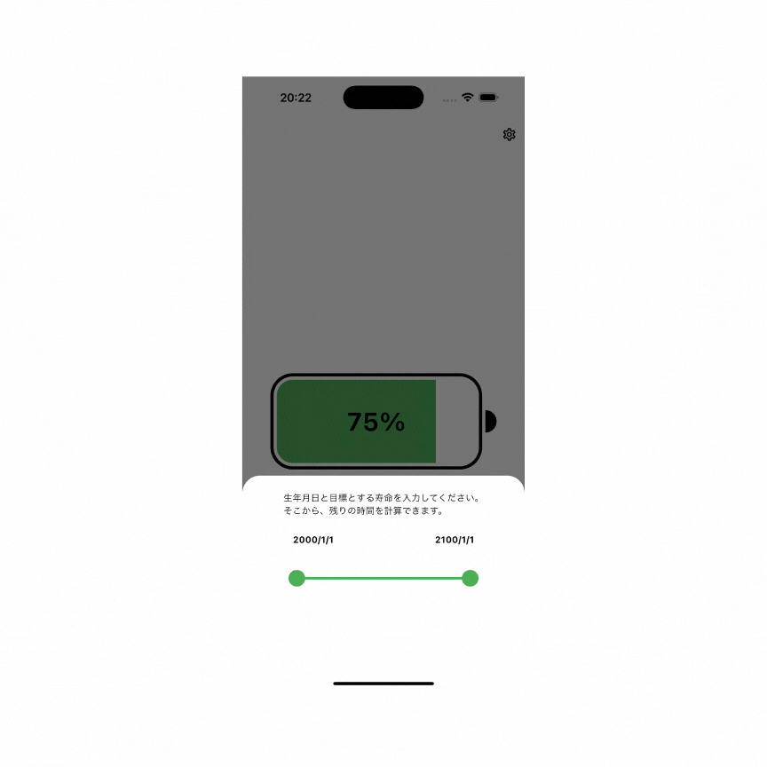

<image src="assets/icon/icon.png" height="100"/>

# Life Battery

 

Life Batteryは、人生があと何%残っているか教えてくれます ⚡️

今後開発する予定の機能:

<ul>
    <li>アプリを開かずにウィジェットでバッテリー残量を確認できる機能 📲</li>
    <li>バッテリー残量が減少した際にプッシュ通知でお知らせする機能 🪫</li>
    <li>バッテリー UI のデザインをカスタマイズできる機能 🎨</li>
    <li>夜空の星空機能 ⭐️</li>
    <li>And more...</li>
</ul>

